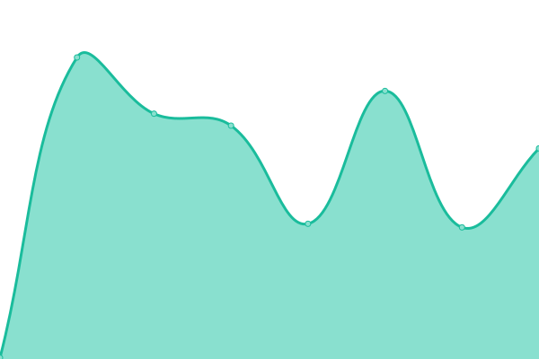
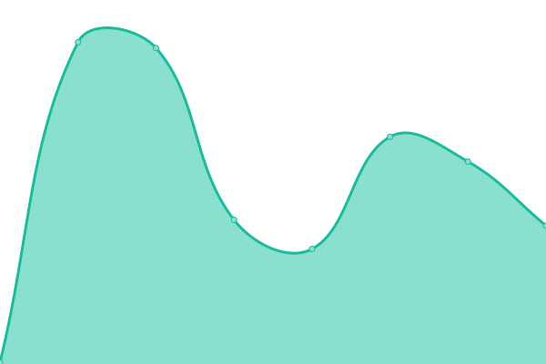

# [📈 Live Status](https://demo.upptime.js.org): <!--live status--> **🟧 Partial outage**

This repository contains the open-source uptime monitor and status page for [Victor Benincasa](https://br.linkedin.com/in/vbenincasa), powered by [Upptime](https://github.com/upptime/upptime).

With [Upptime](https://upptime.js.org), you can get your own unlimited and free uptime monitor and status page, powered entirely by a GitHub repository. We use [Issues](https://github.com/vbenincasa/upptime/issues) as incident reports, [Actions](https://github.com/vbenincasa/upptime/actions) as uptime monitors, and [Pages](https://demo.upptime.js.org) for the status page.

<!--start: status pages-->
<!-- This summary is generated by Upptime (https://github.com/upptime/upptime) -->
<!-- Do not edit this manually, your changes will be overwritten -->
<!-- prettier-ignore -->
| URL | Status | History | Response Time | Uptime |
| --- | ------ | ------- | ------------- | ------ |
|  [Google](https://www.google.com) | 🟩 Up | [google.yml](https://github.com/vbenincasa/upptime/commits/HEAD/history/google.yml) | 

 152ms
     
 | 

<a href="https://vbenincasa.github.io/upptime/history/google">99.12%</a>
    

|  [Unihost EAGLE2](https://eagle2.unihostbrasil.com.br) | 🟩 Up | [unihost-eagle-2.yml](https://github.com/vbenincasa/upptime/commits/HEAD/history/unihost-eagle-2.yml) | 

 361ms
     
 | 

<a href="https://vbenincasa.github.io/upptime/history/unihost-eagle-2">99.91%</a>
    

|  [Netbit RAPTOR4](https://raptor4.netbit.com.br) | 🟩 Up | [netbit-raptor-4.yml](https://github.com/vbenincasa/upptime/commits/HEAD/history/netbit-raptor-4.yml) | 

 372ms
     
 | 

<a href="https://vbenincasa.github.io/upptime/history/netbit-raptor-4">98.72%</a>
    

|  [Antever ANTEVER4](http://antever4.antever.com.br) | 🟩 Up | [antever-antever-4.yml](https://github.com/vbenincasa/upptime/commits/HEAD/history/antever-antever-4.yml) | 

 291ms
     
 | 

<a href="https://vbenincasa.github.io/upptime/history/antever-antever-4">100.00%</a>
    

|  [Antever ANTEVER5](https://antever5.antever.com.br) | 🟩 Up | [antever-antever-5.yml](https://github.com/vbenincasa/upptime/commits/HEAD/history/antever-antever-5.yml) | 

 330ms
     
 | 

<a href="https://vbenincasa.github.io/upptime/history/antever-antever-5">100.00%</a>
    

|  [DA Licensing](https://licensing.directadmin.com) | 🟩 Up | [da-licensing.yml](https://github.com/vbenincasa/upptime/commits/HEAD/history/da-licensing.yml) | 

 181ms
     
 | 

<a href="https://vbenincasa.github.io/upptime/history/da-licensing">100.00%</a>
    

|  [DA Files](https://files.directadmin.com) | 🟩 Up | [da-files.yml](https://github.com/vbenincasa/upptime/commits/HEAD/history/da-files.yml) | 

 107ms
     
 | 

<a href="https://vbenincasa.github.io/upptime/history/da-files">100.00%</a>
    

|  [HV TPA](https://speedtest.tpa.hivelocity.net) | 🟩 Up | [hv-tpa.yml](https://github.com/vbenincasa/upptime/commits/HEAD/history/hv-tpa.yml) | 

 255ms
     
 | 

<a href="https://vbenincasa.github.io/upptime/history/hv-tpa">100.00%</a>
    

|  [HV TPA2](https://speedtest.tpa2.hivelocity.net) | 🟩 Up | [hv-tpa-2.yml](https://github.com/vbenincasa/upptime/commits/HEAD/history/hv-tpa-2.yml) | 

 262ms
     
 | 

<a href="https://vbenincasa.github.io/upptime/history/hv-tpa-2">100.00%</a>
    

|  [HV MIA](https://speedtest.mia.hivelocity.net) | 🟥 Down | [hv-mia.yml](https://github.com/vbenincasa/upptime/commits/HEAD/history/hv-mia.yml) | 

 0ms
     
 | 

<a href="https://vbenincasa.github.io/upptime/history/hv-mia">0.00%</a>
    

|  [HV SAO](https://speedtest.sao1.hivelocity.net) | 🟩 Up | [hv-sao.yml](https://github.com/vbenincasa/upptime/commits/HEAD/history/hv-sao.yml) | 

 507ms
     
 | 

<a href="https://vbenincasa.github.io/upptime/history/hv-sao">100.00%</a>
    

<!--end: status pages-->

[**Visit our status website →**](https://demo.upptime.js.org)

## 📄 License

- Powered by: [Upptime](https://github.com/upptime/upptime)
- Code: [MIT](./LICENSE) © [Victor Benincasa](https://br.linkedin.com/in/vbenincasa)
- Data in the `./history` directory: [Open Database License](https://opendatacommons.org/licenses/odbl/1-0/)
